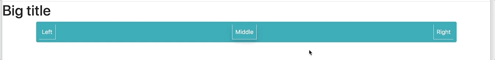

# 0x0A. Bootstrap

Bootstrap is a free and open-source CSS framework directed at responsive, mobile-first front-end web development. It contains CSS and JavaScript design templates for typography, forms, buttons, navigation, and other interface components.

For this project, you will use Bootstrap 4.4 and only the CSS styling part.

## Resources

Read or watch:

- [Bootstrap](https://getbootstrap.com/)
- [Bootstrap Utilities](https://www.w3schools.com/bootstrap4/bootstrap_utilities.asp)
- [Borders in Bootstrap with examples](https://www.geeksforgeeks.org/borders-in-bootstrap-with-examples/)
- [Bootstrap List Group](https://mdbootstrap.com/docs/b4/jquery/components/list-group/)
- [Bootstrap Cards](https://boosted.orange.com/v4-alpha5/components/card/)

## Learning Objectives

At the end of this project, you are expected to be able to explain to anyone, without the help of Google:

- Usage of Containers
- Usage of the Grid system
- Usage of Components
- Usage of Utilities

## Use the CDN version

Add this link in the head part of your HTML

```
<link rel="stylesheet" href="https://stackpath.bootstrapcdn.com/bootstrap/4.4.1/css/bootstrap.min.css" integrity="sha384-Vkoo8x4CGsO3+Hhxv8T/Q5PaXtkKtu6ug5TOeNV6gBiFeWPGFN9MuhOf23Q9Ifjh" crossorigin="anonymous">
```

## Tasks

### [Task 0 - Reboot styling](./0-index.html)

Add Bootstrap to reset the CSS styling.


### [Task 1 - Blocks](./1-index.html)

Build this responsive web page:


### [Task 2 - Table of chemical elements](./2-index.html)

Build this responsive web page:


### [Task 3 - Cards](./3-index.html)

Build this responsive web page:


### [Task 4 - Bob Dylan](./4-index.html)

Build this responsive web page:


### [Task 5 - Show/Hide - screen size](./5-index.html)

Build this responsive web page:


### [Task 6 - Overwrite CSS](./6-styles.html)

Create the custom stylesheet 6-styles.css to match this layout:


## Author

- **Kimberly Hinostroza** - [kimha1030](https://github.com/kimha1030)
